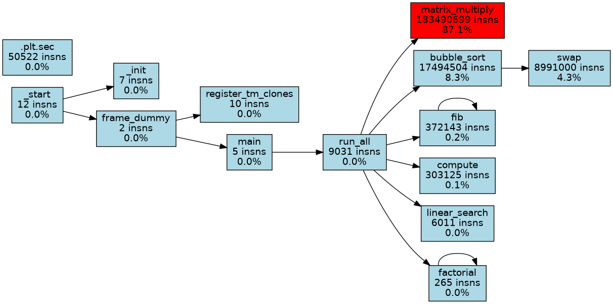

# 🚀 Function Profiler & Call Graph Generator using Intel Pin

A simple function-level profiler built using **Intel Pin Dynamic Binary Instrumentation (DBI)**. The profiler analyzes a program while it is running, counts the instructions executed by each function, tracks function calls, and generates a graphical call graph to help visualize the program's execution flow.

---

## 📖 About the Project

This project was developed as part of my **Computer Architecture** course to understand how runtime profiling works using **Intel Pin**.

Instead of modifying the source code, Intel Pin instruments the executable while it is running. Using this approach, the profiler records:

- Number of instructions executed by each function
- Number of times each function is called
- Caller → callee relationships
- Performance hotspots based on instruction count

Finally, it generates both a detailed profiling report (`funccount.out`) and a graphical call graph (`callgraph.png`) for easy analysis.

---

## ✨ Features

- Dynamic runtime instrumentation using Intel Pin
- Function-wise instruction counting
- Function call counting
- Caller–callee relationship tracking
- Automatic call graph generation using Graphviz
- Identifies performance hotspots
- Generates a profiler report similar to GNU gprof

---

## 🛠️ Technologies Used

- **Language:** C++
- **Framework:** Intel Pin
- **Visualization:** Graphviz
- **Compiler:** GCC
- **Platform:** Ubuntu (WSL)

---

## ⚙️ How It Works

```text
Target Program
      │
      ▼
 Intel Pin
      │
      ▼
Instrument Functions
      │
      ▼
Count Instructions
      │
      ▼
Track Function Calls
      │
      ▼
Generate Reports
      │
      ▼
Create Call Graph
```

---

## 📂 Project Structure

```text
Function-Profiler-Intel-PIN
│
├── src/
│   └── funccount.cpp
│
├── sample_programs/
│   ├── hello.c
│   └── heavy.c
│
├── outputs/
│   ├── funccount.out
│   ├── callgraph.dot
│   └── callgraph.png
│
├── docs/
├── README.md
└── LICENSE
```

---

## 📊 Sample Output

The profiler generates a graphical call graph showing:

- Function hierarchy
- Instruction counts
- Instruction percentage for each function
- Caller–callee relationships
- Performance hotspots

<p align="center">
  
</p>

### From the generated output

- `matrix_multiply()` executes the highest number of instructions, making it the primary performance hotspot.
- The call graph clearly shows how functions call one another.
- Recursive functions such as `fib()` and `factorial()` are represented correctly with self-loops.
- Functions like `bubble_sort()` and `swap()` are also highlighted based on their instruction contribution.

---

## 📄 Generated Files

### `funccount.out`

Contains:

- Function name
- Instruction count
- Number of function calls
- Percentage of total executed instructions

### `callgraph.dot`

A Graphviz DOT file describing the generated call graph.

### `callgraph.png`

A graphical visualization of function execution, instruction counts, and caller–callee relationships.

---

## ▶️ How to Run

```bash
cd ~/pin_kit/source/tools/ManualExamples

gcc -O0 -g -o hello hello.c -lm

make PIN_ROOT=~/pin_kit obj-intel64/funccount.so

~/pin_kit/pin -t obj-intel64/funccount.so -- ./hello

cat funccount.out

dot -Tpng callgraph.dot -o callgraph.png
```

---

## 💡 Applications

- Software performance analysis
- Finding performance hotspots
- Understanding program execution flow
- Performance optimization
- Compiler and Operating Systems research
- Learning Dynamic Binary Instrumentation (DBI)

---

## 🎯 Conclusion

This project demonstrates how **Intel Pin** can be used to build a lightweight function profiler without modifying the original program. By dynamically instrumenting the executable, the profiler collects instruction-level statistics, tracks function calls, and generates an easy-to-understand call graph that helps analyze program behavior and identify performance hotspots.
