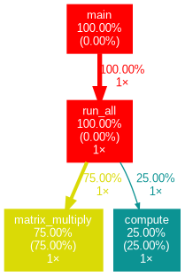
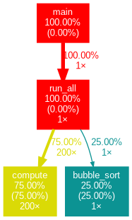

# Function Profiler & Call Graph Generator using Intel Pin

> A function-level profiler built using **Intel Pin Dynamic Binary Instrumentation (DBI)** to analyze program execution, collect runtime function statistics, and generate graphical call graphs for performance analysis.

---

## 📌 Project Overview

Function Profiler & Call Graph Generator is a systems programming project developed to analyze the runtime behavior of applications without modifying their source code.

The profiler dynamically instruments the target executable using the Intel Pin framework, records function execution statistics, counts executed instructions, tracks caller-callee relationships, and generates both textual profiling reports and graphical call graphs.

This project demonstrates the practical use of **Dynamic Binary Instrumentation (DBI)** for performance analysis and software optimization.

---

# 🎯 Problem Statement

Understanding the runtime behavior of software is essential for performance optimization.

Traditional debugging tools provide limited execution insights, making it difficult to identify:

* Frequently executed functions
* Performance bottlenecks
* Function call hierarchy
* Instruction-level execution statistics

This project addresses these challenges by automatically collecting runtime profiling information and visualizing function relationships through call graphs.

---

# ✨ Features

* Dynamic Binary Instrumentation using Intel Pin
* Runtime Function Profiling
* Instruction Count Analysis
* Function Call Counting
* Caller–Callee Relationship Tracking
* Graphviz-based Call Graph Generation
* Hotspot Detection
* GNU gprof-style Profiling Report

---

# 🛠️ Technology Stack

### Programming Language

* C++

### Framework

* Intel Pin

### Visualization

* Graphviz

### Operating System

* Ubuntu (WSL)

---

# 🏗️ System Workflow

```text
Target Program
        │
        ▼
 Intel Pin Framework
        │
        ▼
Function Instrumentation
        │
        ▼
Instruction Counting
        │
        ▼
Call Relationship Tracking
        │
        ▼
Generate Reports
   ├── funccount.out
   └── callgraph.dot
                │
                ▼
          Graphviz
                │
                ▼
        callgraph.png
```

---

# 📂 Project Structure

```text
Function-Profiler-Intel-PIN
│
├── src
│   └── funccount.cpp
│
├── sample_programs
│   ├── hello.c
│   └── heavy.c
│
├── outputs
│   ├── funccount.out
│   ├── graph.png
│   └── final.png
│
├── screenshots
│
├── docs
│
├── README.md
├── LICENSE
└── .gitignore
```

---

# 🚀 How to Build & Run

## 1. Navigate to the Intel Pin ManualExamples directory

```bash
cd ~/pin_kit/source/tools/ManualExamples
```

## 2. Compile the sample program

```bash
gcc -O0 -g -o hello hello.c -lm
```

## 3. Build the Pintool

```bash
make PIN_ROOT=~/pin_kit obj-intel64/funccount.so
```

## 4. Run the profiler

```bash
~/pin_kit/pin -t obj-intel64/funccount.so -- ./hello
```

## 5. View profiling report

```bash
cat funccount.out
```

## 6. Generate the graphical call graph

## Call Graph



## Profiling Output



# 📊 Outputs

The profiler generates:

* **funccount.out** – Function-wise instruction statistics
* **callgraph.dot** – Graphviz call graph description
* **callgraph.png** – Graphical visualization of caller–callee relationships

---

